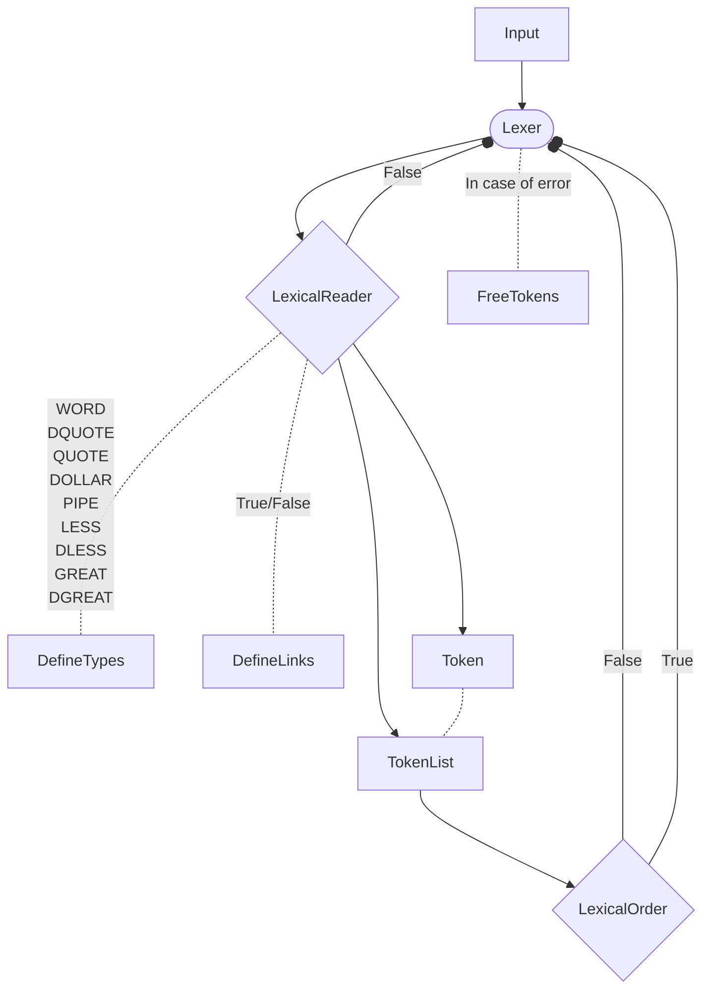
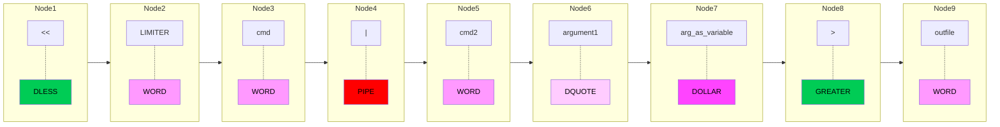

# Lexer

## Code



Takes a string and returns a list of tokens.

Example:

```shell
$ << LIMITER cmd | cmd2 "argument1" $arg_as_variable > outfile
```

Transform into a list of tokens:



### Handling

#### $ (DOLLAR)

If the character is a dollar sign, then the lexer should return a DOLLAR token.

If the dollar sign is not followed by a alphanumeric character, then the lexer should return a WORD token. (Same if the dollar sign is at the end of the string).

#### " (DQUOTE)

The lexer should return a DQUOTE token when it encounters a double quote character (") that is closed by another double quote character. If the double quote character is not closed, then the lexer should return a lexical error.

#### ' (QUOTE)

The lexer should return a QUOTE token when it encounters a single quote character ('). If the single quote character is not closed, then the lexer should return a lexical error.

#### < (LESS)

The lexer should return a LESS token when it encounters a less than character (`<`). If the less than character is followed by another less than character, then the lexer should return a DLESS token.

If the dless (`<<`) is followed by another less (`<`) than character, then the lexer should return a lexical error.

#### > (GREATER)

The lexer should return a GREATER token when it encounters a greater than character (`>`). If the greater than character is followed by another greater than character, then the lexer should return a DGREATER token.

If the dgreater (`>>`) is followed by another greater (`>`) than character, then the lexer should return a lexical error.

#### | (PIPE)

The lexer should return a PIPE token when it encounters a pipe character (`|`). If the pipe character is followed by another pipe character, then the lexer should return a lexical error.

If the pipe character is at the start/end of the string, then the lexer should return a lexical error.

If there is no word between two pipe characters, then the lexer should return a lexical error.

## Notions

A lexer, also known as a tokenizer, breaks a string down into smaller pieces, called tokens. These tokens can be words, numbers, symbols, or other meaningful elements. The lexer is the first step in the process of interpreting a string of characters, and it plays a crucial role in the process of parsing.

The lexer takes a string of characters as input and produces a sequence of tokens as output. Each token represents a single element of the input string, and the sequence of tokens represents the structure of the input string.

The output of the lexer is typically fed into a parser, which uses the tokens to build a more structured representation of the input string, such as an abstract syntax tree or a sequence of instructions.

### Tokens
`"printable"` or `text without other lexical type` = WORD

`<` = LESS

`>` = GREATER

`>>` = DGREATER

`<<` = DLESS

`|` = PIPE

`$` = DOLLAR

`'` = QUOTE

`"` = DQUOTE

#### isspace

` ` = SPACE

`\t` = TAB

`\n` = NEWLINE

`\r` = CARRIAGE

`\v` = VERTICAL

`\f` = FORMFEED

#### check for empty tokens

`|` no empty pipe

`>` no empty greater

`<` no empty less

`>>` no empty dgreater

`<<` no empty dless

### Metacharacters

Metacharacters are characters that have a special meaning in a programming language or command interpreter. They are used to control the flow of a program or to manipulate text. For example, in the C programming language, the `*` character is used to declare a pointer, and the `&` character is used to get the address of a variable. In the Unix shell, the `|` character is used to pipe the output of one command into the input of another command.

#### $ (DOLLAR)

The dollar sign is a metacharacter in many programming languages and command interpreters. In the Unix shell, the dollar sign is used to indicate that a word is a variable name, and the value of the variable should be substituted in its place. For example, if the variable `foo` has the value `bar`, then the command `echo $foo` will print `bar`.

#### Metacharacter Injection

Many systems, such as `SQL interpreters` and the `command line shell`, have metacharacters, that is, characters in their input that are not interpreted as data. Such characters might commands, or delimit data from commands or other data. If there’s a language specification for that system’s interface that you’re using, then it certainly has metacharacters. If your program invokes those other systems and allows attackers to insert such metacharacters, the usual result is that an attacker can completely control your program.

##### Shell Injection

Many metacharacter problems involve shell metacharacters. An attack that tries to exploit a vulnerabliity in shell metacharacter processing is called a shell injection attack. For example, the standard Unix-like command shell (typically stored in /bin/sh) interprets a number of characters specially. If these characters are sent to the shell, then their special interpretation will be used unless escaped; this fact can be used to break programs. 

<details>
<summary>Example of shell injection</summary>

For example, the following command line:

```sh
ls -l $HOME
```

will list the contents of the user's home directory. However, if the user's home directory is `/home/username; rm -rf /`, then the following command line:

```sh
ls -l $HOME
```

will list the contents of the user's home directory and then delete everything in the root directory. This is because the shell will interpret the $HOME variable and execute the command:

```sh
ls -l /home/username; rm -rf /
```

</details>
