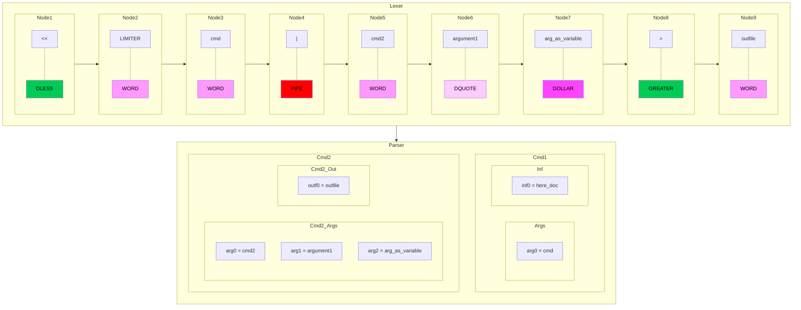

# Parser

A parser is a software component that processes input data, typically text, and builds a data structure, such as a parse tree or abstract syntax tree, which represents the syntactic structure of the input. The parser is often preceded by a lexer, which converts the input text into a sequence of tokens.

In our context the parser transform the nodes obtained after our lexical analysis. This nodes will be use to create another list of nodes that will gather the needed informations for the command execution.

## Code



### Case:

If element is `WORD` , `DQUOTE` or `DOLLAR` and they are not separated by a space or special character, they are part of the same argument.

Example:
```sh
echo Hello$USER
```

```shell
Hellorcutte
```

and not:

```shell
Hello rcutte
```
## Notions

:bookmark_tabs: [Parser - Definition and Types](https://www.techtarget.com/searchapparchitecture/definition/parser)
