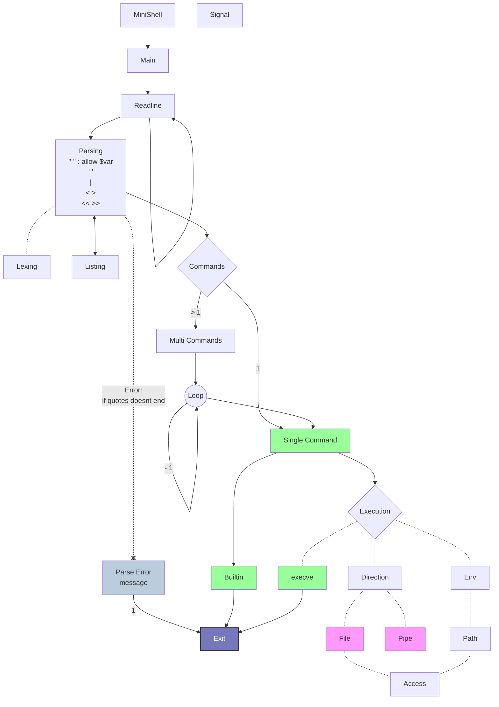

# MiniShell

```mermaid
graph TD
  classDef exit fill:#77b,stroke:#333,stroke-width:2px,color:#fff;
  classDef cmd fill:#9f9;
  classDef msg fill:#bcd;
  classDef file fill:#f9f;
    A[MiniShell] --> B[Main]
    B --> readline[Readline]
    readline --> readline
    readline --> parser["Parsing\n '' '' : allow $var\n' '\n |\n <  >\n<<  >>"]
    parser -.- lexer[Lexing]
    parser -.-x |Error:\nif quotes doesnt end| parse_error[Parse Error\nmessage]:::msg
    parse_error -->|1| Exit:::exit
    parser <--> list[Listing]
    parser --> command{Commands}
    command -->|1| single[Single Command]:::cmd
    command -->|> 1| multi[Multi Commands]
    multi --> loop((Loop))
    loop -->|- 1| loop
    loop --> single
    single --> exec{Execution}
    single --> builtin[Builtin]:::cmd
    exec -.- direction[Direction]
    direction -.- file[File]:::file
    file -.- access[Access]
    direction -.- pipe[Pipe]:::file
    exec -.- env[Env]
    env -.- path[Path]
    path -.- access
    exec -.- execve:::cmd
    builtin --> Exit
    execve --> Exit

    signal[Signal]
```