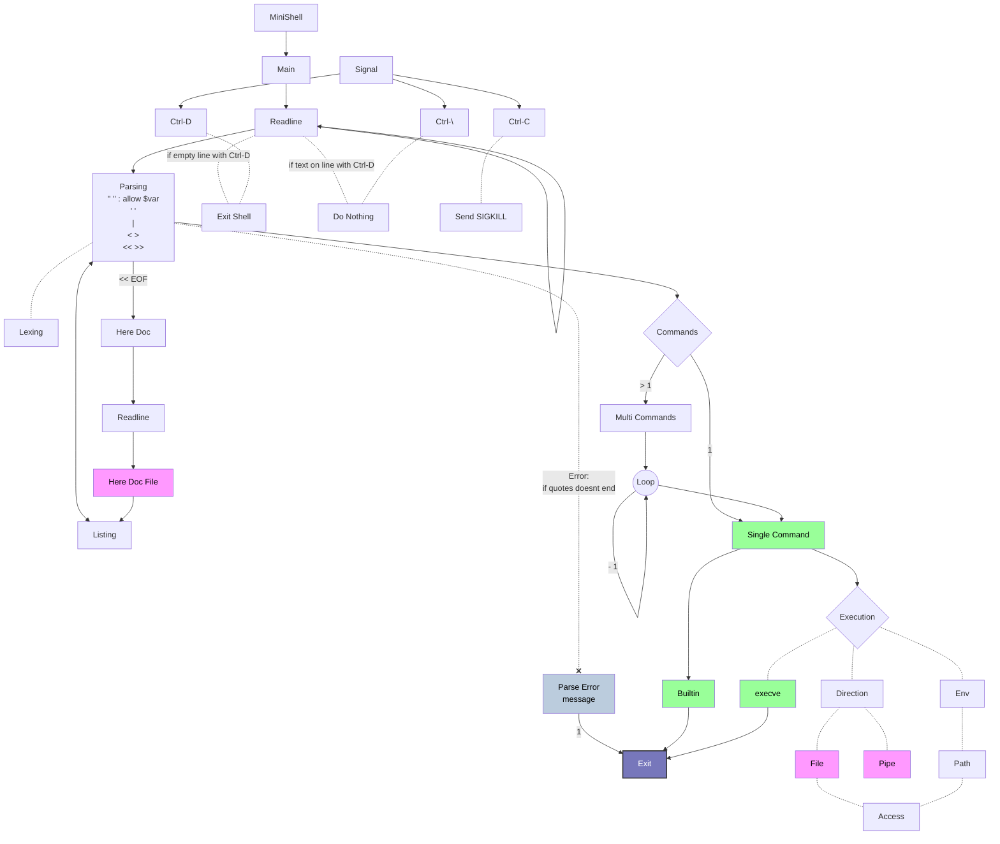

# MiniShell



## Listing

- types:
  - pipe `|`
  - redirection
    - input `<`
    - output `>`
    - append `>>`
    - here_doc `<<` followed LIMITER
  - file
    - infile
    - outfile
  - command
    - list of args[0];
  - args
    - list of args

### Redirection


- input
  - link to stdin of the command before the next pipe
  - in case multiple `<` input with the same command, dup2 in order of appearance:
    - dup2(fd, 0)
    - dup2(fd2, 0)
- output
- append
- here_doc

Example of redir << here_doc and input:
```shell
$> << EOF cat > test | << EOF cat | wc
> jf
> jf
> EOF
> df
> df
> df
> EOF
      3       3       9
$> cat test
jf
jf
```

Example of redir > output:
```shell
<< EOF cat | cat > test_output | < test cat > test_output2
> test1
> test1
> test1
> EOF
$> cat test_output
test1
test1
test1
$> cat test_output2
jf
jf
```

### Parser

### Here Doc

Search for `<<` and `LIMITER` and replace the line with the content until `LIMITER` is found.

Launch readline but do not save the line in the history.

```c
line = readline("here_doc> ");
```

Store content in a heredoc file. This heredo file will be stored as an infile and also stored in a list of heredoc files to be deleted at the end of the program.
