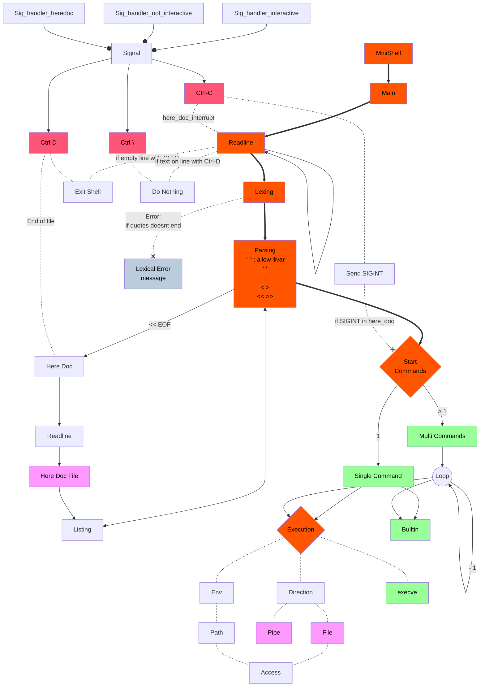
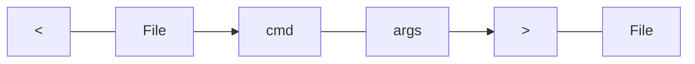

# MiniShell



## Test

### Prompts

Here is a list of prompts to see if your shell is working correctly (Not all prompts are mandatory, but it's a good way to test your shell):

🔗 [List of prompts](https://docs.google.com/spreadsheets/d/1uJHQu0VPsjjBkR4hxOeCMEt3AOM1Hp_SmUzPFhAH-nA/edit#gid=0)

### Leaks

To suppress readline leaks, use the following command (with `readline.supp` in the same directory as the executable):
```shell
valgrind --leak-check=full --show-leak-kinds=all --track-fds=yes --suppressions=readline.supp ./minishell
```

## Listing

- types:
  - pipe `|`
  - redirection
    - input `<`
    - output `>`
    - append `>>`
    - here_doc `<<` followed LIMITER
  - file
    - infile
    - outfile
  - command
    - list of args[0];
  - args
    - list of args

### Redirection


- input
  - link to std_in of the command before the next pipe
  - in case multiple `<` input with the same command, dup2 in order of appearance:
    - dup2(fd, 0)
    - dup2(fd2, 0)
- output
- append
- here_doc

Example of redir << here_doc and input:
```shell
$> << EOF cat > test | << EOF cat | wc
> jf
> jf
> EOF
> df
> df
> df
> EOF
      3       3       9
$> cat test
jf
jf
```

Example of redir > output:
```shell
<< EOF cat | cat > test_output | < test cat > test_output2
> test1
> test1
> test1
> EOF
$> cat test_output
test1
test1
test1
$> cat test_output2
jf
jf
```

### Parser

#### Here Doc

Search for `<<` and `LIMITER` and replace the line with the content until `LIMITER` is found.

Launch readline but do not save the line in the history.

```c
line = readline("here_doc> ");
```

Store content in a heredoc file. This heredo file will be stored as an infile and also stored in a list of heredoc files to be deleted at the end of the program.

###### Handling Signals (with readline inside here_doc)

```c
variable rl_catch_signals = 0;
```

Handle `Ctrl-C` and `Ctrl-D` signals. When signals are caught, the stdin is closed and the heredoc file is deleted. To prevent error of display with readline, we stop readline to listen to signals. Here preventing two new lines instead of one.

###### Closing heredoc

When `LIMITER` is found, the heredoc file is closed and the heredoc event is stopped.

Or when `Ctrl-D` is pressed, the heredoc file is closed and the heredoc event is stopped.
To close it we use `close(stdin)`.

##### Signals

In bash:

If `Ctrl-C` is pressed, the heredoc file is deleted and the heredoc event is stop, the shell however must continue and the input is saved in history.

if `Ctrl-D` is pressed, it's like using the LIMITER in the heredoc.

`Ctrl-\` is `SIGQUIT`. Ignored in interactive mode.

###### Ignoring signal handler

The signal handler `sig_handler_interactive` in interactive mode display new prompt and clear `rl_line_buffer`. We can ignore this signal handler by setting `rl_catch_signals` to 0. `Ctrl-\` is ignored.

In non interactive mode, `Ctrl-C` is restored as `default` handler (in child process, `SIG_DFL` which is a macro to restore handler) and `Ctrl-D` is handled as `EOF`. `Ctrl-\` is like `Ctrl-C` but write `"Quit (core dumped)\n"` to stderr.

###### Signals returns

Exit status is 128 + signal number.

##### Exit status

With exit builtin.

The exit code should be coded on 8 bits. If the exit code is greater than 255, the shell should return the exit code modulo 256. If the exit code is less than 0, the shell should return the exit code modulo 256 -> + 256 -> modulo 256.

##### Particular cases

Particular cases with the format of `LIMITER` :

<details><summary>When double or simple quotes are present and closed, expansions does not happen. Quotes are not part of the LIMITER.</summary>

```bash
$> << "LIM" cat
> $PATH
> LIM
$PATH
```

</details>

<details><summary>Closed quotes are ignored and expansions does not happen.</summary>

```bash
$> << LIM''"" cat
> hey
> LIM
hey
```

</details>

<details><summary>Another case with quotes : quotes ignored in LIMITER and no expansions.</summary>

```bash
$> << L"I"M cat
> $PATH
> LIM
$PATH
```

</details>

<details><summary>As we should not interpret backslash character (\\) and unclosed quotes, in bash LIMITER would be LI"M but we will ask LI\"M as a limiter.</summary>

```bash
$> << LI\"M cat
> hey
> LI\"M
hey
```

</details>

<details><summary>Unclosed quotes should not be interpreted so expansions happen.</summary>

```bash
$> << LIM"' cat
>> hey
>> LIM
hey
```

</details>

## Commands

### Particular cases

#### Empty command with redirection

```shell
$> < infile > outfile
```

This input is valid and the redirections are applied to the shell. In this case, the shell will not execute any command and will only apply the redirections.